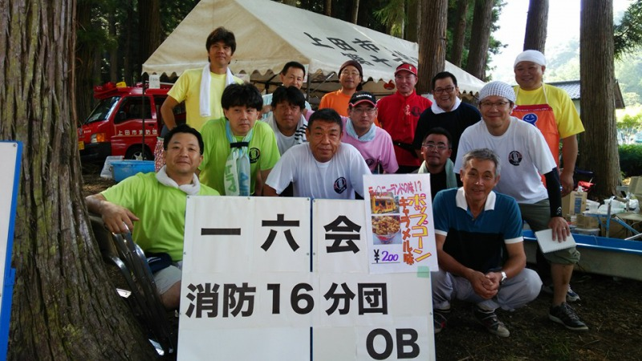
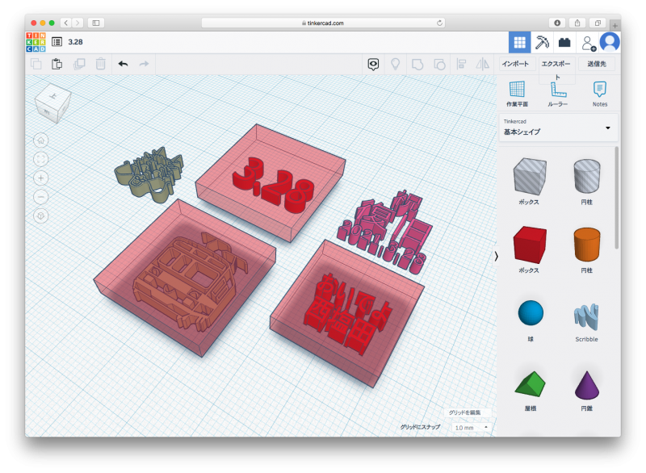

# 一六会コーヒーショップへようこそ

あなたは  番目のお客様です。

### おしながき

- ホットコーヒー　100円
- コーヒーとクッキーのセット　150円
- わたあめ　無料

コーヒーは山田神社の湧き水を使用して~~いれています~~いれる予定でした…。

## 一六会って？

メンバーは全員、上田市消防団第十六分団のOBです。地域の子どもたちに夢と希望、そして地域への誇りを持ってもらえたらという思いから、西塩田地区内で開催される各種イベントに出店しています。

## 今日のクッキー

メンバーの家族お手製のクッキーです。変わったものは何も入っていませんが、ほのかな甘味から連食の罪悪感を感じさせないままついついパクパク食べ過ぎてしまうので、今日は8個入りの小分けパックになっています。

模様の型押しはTinkercadでモデリングしたデータを同僚に頼んでプリントしてもらったものです。「おせんちゃん」の画像データは、[こちらのページ](https://www.city.ueda.nagano.jp/site/besshosen/16495.html)から拝借しました。

## 公共交通機関を使おう！

当コーヒーショップの中の人は舞田駅からしなの鉄道御代田駅まで電車で通勤しています。自宅から舞田駅までは自転車で約10分、御代田駅から勤務先の会社までは徒歩で20分。途中の乗り換えを含めると行きは1時間40分、帰りは接続が悪く、2時間ちょっとかかってしまいます。クルマなら片道1時間程度ですが、終始緊張の伴う運転とは違い、自由気ままに過ごせる電車通勤は私にとっては気楽です。決まった時間に合わせて行動する窮屈さも、慣れればあまり気になりません。（個人の感想です）

最後までお読みいただき、ありがとうございました！

- [おいでよ西塩田 Twitter @OideNishiShioda](https://twitter.com/OideNishiShioda)
- [一六会 Facebook @16kai](https://www.facebook.com/16kai)
