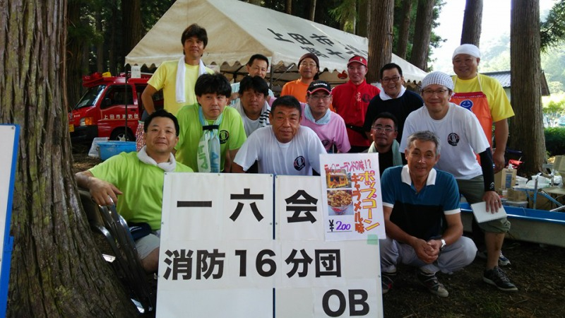
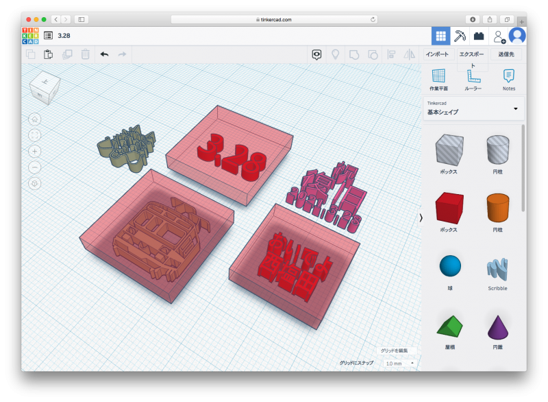

# 一六会コーヒーショップへようこそ

いらっしゃいませ。あなたは  番目のお客様です。

### おしながき

- ホットコーヒー　100円
- コーヒーとクッキーのセット　150円
- わたあめ　無料

コーヒーは山田神社の湧き水を使用して~~いれています~~いれる予定でした…。

## 一六会って？

メンバーは全員、上田市消防団第十六分団のOBです。地域の子どもたちに夢と希望、そして地域への誇りを持ってもらえたらという思いから、西塩田地区内で開催される各種イベントに出店しています。

### 出店予定

- ほたる祭り（6月中旬）
- 花市（8月12日）
- とっこ館収穫祭（10月末）

## 今日のクッキー

特定原材料「小麦粉」を含みます。

メンバーの家族お手製のクッキーです。変わったものは何も入っていませんが、ほのかな甘味から連食の罪悪感を感じさせないままついついパクパク食べ過ぎてしまうので、今日は8個入りの小分けパックになっています。

模様の型押しはTinkercadでモデリングしたデータを同僚に頼んでプリントしてもらったものです。「おせんちゃん」の画像データは、[こちらのページ](https://www.city.ueda.nagano.jp/site/besshosen/16495.html)から拝借しました。

## 西塩田へ来てみて！

信州の鎌倉と言われる塩田平。その南西部、西塩田地域には不思議な魅力がいっぱい。お時間のあるときに、足をのばしてみてください。順不同、中の人の勝手なチョイスで、7か所ほど名所をご紹介します。（表示時間は推定）

- [前山寺（重要文化財・三重塔）](https://ja.wikipedia.org/wiki/前山寺) 徒歩45分
- [中禅寺（重要文化財・薬師堂）](https://ja.wikipedia.org/wiki/中禅寺_(上田市)) 徒歩45分
- [フレッシュストアー西沢（お惣菜・お弁当）](https://www.instagram.com/fresh.nishizawa) 徒歩30分
- [ことぶき（食堂）](https://www.google.com/search?client=safari&rls=en&q=ことぶき&ie=UTF-8&oe=UTF-8) 徒歩30分
- [鞍が淵（民話「竜の子太郎」）](http://db.umic.jp/johogura/datadisp.php?arg_sano=2064006) 徒歩1時間
- [女神山城（石垣・土塁跡）](https://www.hb.pei.jp/shiro/shinano/megamiyama-jyo/) 徒歩1時間45分
- [とっこ館・舌喰池（少雨地帯なので溜池がたくさん）](http://www.shiodanosato.jp) 徒歩25分

## 公共交通機関を使おう！

当コーヒーショップの中の人は舞田駅からしなの鉄道御代田駅まで電車で通勤しています。自宅から舞田駅までは自転車で約10分、御代田駅から勤務先の会社までは徒歩で20分。途中の乗り換えを含めると行きは1時間40分、帰りは接続が悪く、2時間ちょっとかかってしまいます。クルマなら片道1時間程度ですが、終始緊張の伴う運転とは違い、自由気ままに過ごせる電車通勤は私にとっては気楽です。決まった時間に合わせて行動する窮屈さも、慣れればあまり気になりません。（個人の感想です）

最後までお読みいただき、ありがとうございました！

- [おいでよ西塩田 Twitter @OideNishiShioda](https://twitter.com/OideNishiShioda)
- [一六会 Facebook @16kai](https://www.facebook.com/16kai)

2021-03-28
