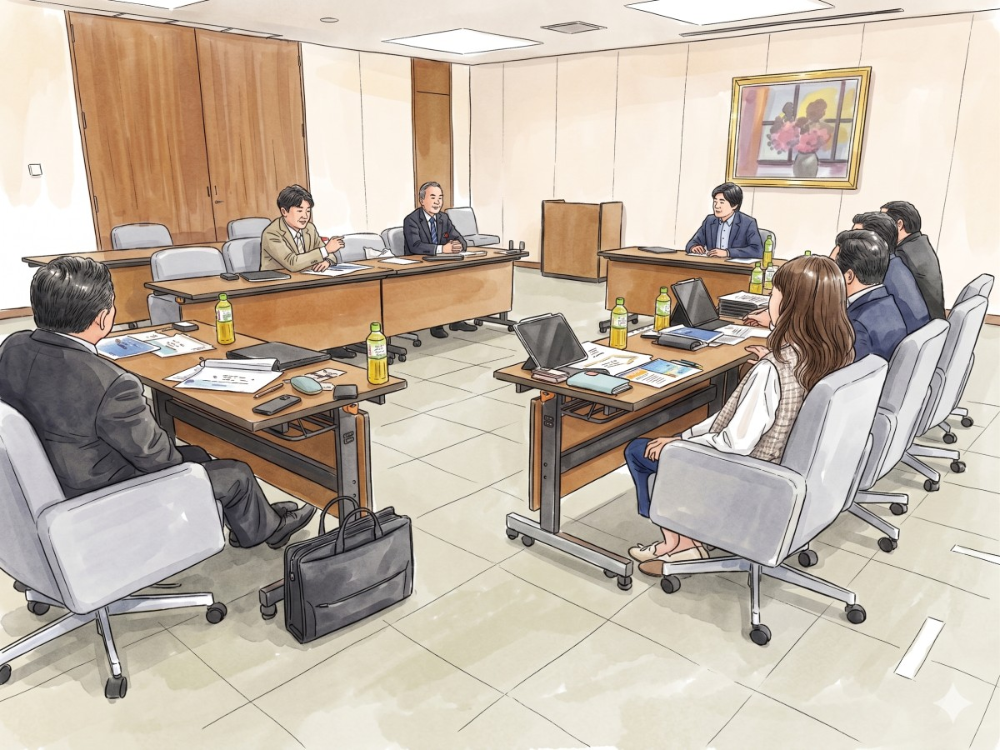

上田市議会議員の塩入友広です。
前回の更新から少し間が空いてしまいました。楽しみにしてくださっていた皆さま、申し訳ありません。

議員としての活動が始まり、サラリーマン時代とは全く異なる時間の流れに、実はまだ戸惑いを感じる日々を過ごしています。通勤という決まったルーティンがあった頃とは違い、一日、一週間をどう組み立てるか。次々と湧き上がる「やりたいこと」に心を奪われ、つい「やらなくてはならないこと」を後回しにしてしまう自分の癖と戦いながら、現在は6月定例会での一般質問に向けた情報収集に全力を注いでいます。

## 地元での嬉しい再会と、新たな出会い

この時期は地域で活動される様々な団体の定期総会にお招きいただく機会が多く、多くの市民の皆さまと挨拶をさせていただいています。「はじめまして」と名刺を交わした方が、実は以前から親しくしている方のきょうだいであったり、SNSで以前から交流のあった方と初めて対面できたりと、地元ならではの温かい繋がりに元気をいただく毎日です。こうした顔の見える関係こそが、政治の原点であることを肌で感じています。

## 長野県の「営業力」を学ぶ

先日、以前よりお世話になっている県議会議員の紹介で、長野県庁にて勉強会を行う貴重な機会をいただきました。

特に印象深かったのは、全国の自治体で唯一設置されている「営業本部」の取り組みです。大手総合商社出身の方が陣頭指揮を執り、「信州」というブランドを世界へ売り込む姿には圧倒されました。実は、私の前職（工作機械メーカーでの技術職）でもその商社とは深い縁があり、個人的にも非常に信頼を寄せている企業でした。かつて、私は商社という業態に対して単なる「仲介役」というイメージしか持っていませんでした。しかし、この企業の方々がメーカーの商品を徹底的に研究し、あたかも自社製品のように顧客へ提案する姿勢には、ものづくりに携わってきた一人として深く感動したことを覚えています。そのプロフェッショナリズムが今、「信州」のために動いていることは、非常に心強い限りです。

## 信州の産業の未来へ

また、産業労働部の方々からは、国が取り組んでいる「地域未来戦略」についてお話を伺いました。驚いたのは、以前このニュースレターで私なりに考察し、発信していた内容が、今まさに国の「地域産業クラスター計画」や「地場産業成長プラン」として具体的に動き出しているという事実です。自分の持っていた問題意識と、国や県の政策の大きなうねりがピタリと合致し、「シンクロ」しながら進んでいる。その事実に驚くと同時に、自分の掲げるビジョンの妥当性を強く再確認する機会となりました。県が推進する航空宇宙産業などの例に対し、私は自らの経験も踏まえ、さらに踏み込んで医療産業への参入や、県内に数多く存在する「ニッチトップ企業」への展開も検討してほしいと提案させていただきました。

（参考記事：[「聴こえの支援から考える、地域産業の新たな可能性　〜医療機器の国産化と、障害者のQOL向上を目指して〜」](https://shioiri.theletter.jp/posts/9b9d0a20-ea20-11f0-84dc-b352bcf7c782)）

## 新たな可能性を地域のために

一昨日は、地元選出の井出庸生衆議院議員とも意見交換をさせていただく機会がありました。自分の考えを直接国会議員へ伝え、議論できること。これは市議会議員という立場になって初めて実感した、大きな可能性のひとつです。

私は技術者として長年、問題解決において「枝葉よりも幹」「応急処置よりも根本治療」を信条としてきました。その姿勢は政治の世界でも変わりません。将来世代に負担を残さないよう、身近な課題に対して「根本治療」による解決を目指します。そのために、市・県・国を繋ぐパイプ役となり、地域のために尽力してまいります。

何か日常でのお困りごとや市政に関するご質問などございましたら、どうかお気軽にお声がけください。

[過去の記事は、こちら（しおいり通信のトップページ）からお読みいただけます。](https://shioiri.theletter.jp)

塩入友広　TEL 090-3558-5540