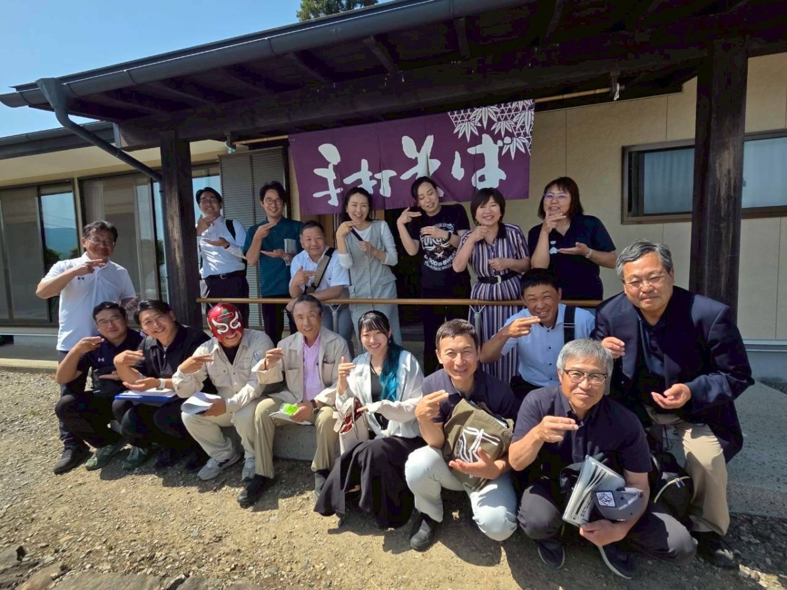
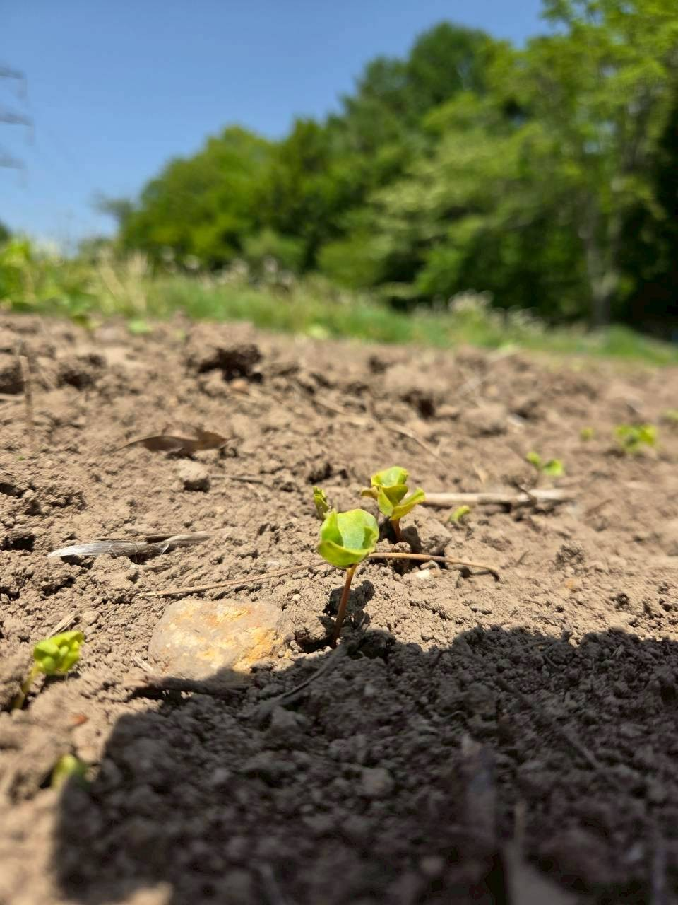
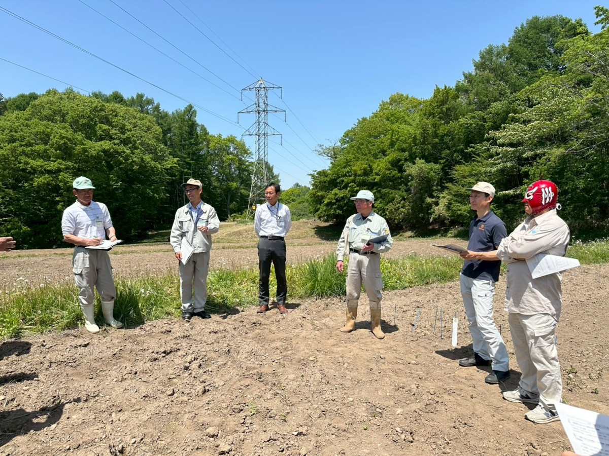
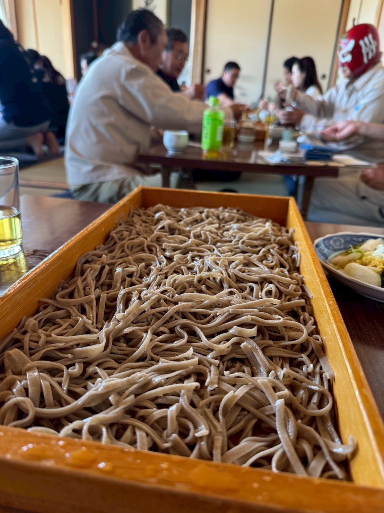

信州人なら誰しも「そば県といえば長野県で決まり！」と思いたいところですが、岩手県の「わんこそば」や島根県の「出雲そば」も強力なライバルです。過去の一般投票では、お蕎麦の美味しい県として福井県がランキング１位に輝いたこともあるのだとか。

そんな中、同僚議員に誘っていただき、このたび「長野県をそば県にする議員の会（通称：そば議連）」に入会いたしました。長野県の誇るそば文化をさらに盛り上げるべく、さっそく視察へ行ってまいりました。

## 新品種開発の最前線　富士見町の試験圃場を視察

蕎麦は荒れた土地でもたくましく育つというイメージがありますが、実は天候、特に湿害に弱く、収量が安定しにくい作物なのだそうです。

長野県では、国が定める主要穀物（米・麦・大豆）と同等の調査・研究を蕎麦に対しても行っており、現在はその安定した収量を確保するため、年に２回の収穫を行う「二期作」に適した新品種の開発を進めています。栽培試験は「寒冷地」「中山間地」「低暖地」の３地点で行われており、今回は富士見町にある寒冷地試験圃場を見学させていただきました。

##　農業振興の第一線で活躍するお隣りさん

今回の視察で、何よりも驚いたのは、なんと、現地で県の担当者として私たちを案内してくださったのが、私の自宅のお隣りさんだったのです。毎日、諏訪まで通っているのだそう。

## 信州そばの美味しさと、未来への熱い展望

見学の後は、お待ちかねの昼食タイム。自家栽培・自家製粉のこだわり「十割蕎麦」に舌鼓を打ちました。とーっても美味しいお蕎麦に、舌の肥えた議員一同も大満足の様子でした。

食後は、伊那市を中心に信州そばの普及活動をされている下平彩楓さん（Instagram）から、現状への懸念や将来の展望について熱い思いをお聞きしました。

長野県の伝統的な食文化を守り、さらに発展させていくために何ができるか。今回の学びを今後の議会活動にも活かしてまいります。

今日も最後までお読みいただき、ありがとうございました！

[過去の記事は、こちら（しおいり通信のトップページ）からお読みいただけます。](https://shioiri.theletter.jp)

塩入友広　TEL 090-3558-5540