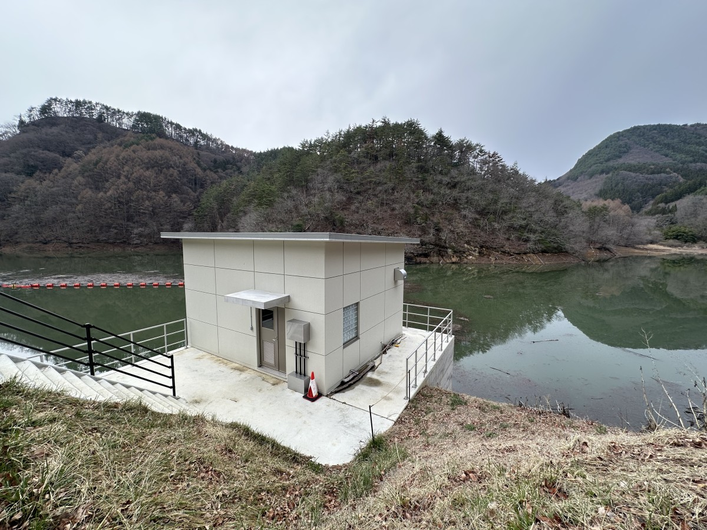
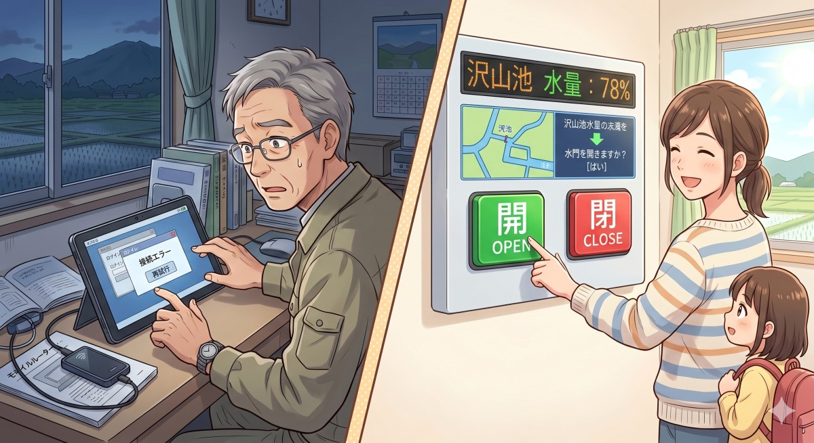

新緑の季節を迎え、西塩田の水田では今、盛んに田植えが行われています。この豊かな水田を支える「水」の多くは、野倉にある沢山池からの配水によって賄われています。

今年から、この沢山池の水門が遠隔操作化されたことをご存知でしょうか。これまでは早朝にわざわざ現地まで赴き、手作業で行っていた水門操作が、操作する人（手塚地区の自治会長さん）が自宅から行えるようになりました。

一見すると、最新技術の導入によって現場の負担が軽減されたスマート化の成功例のように思えます。しかし、自治会長さんの話を聞くと、必ずしも利便性が向上したとは言えない実態が見えてきます。

## 効率化の裏にある新たな運用負荷

水門の遠隔操作には専用のタブレット端末が使用されています。自治会長さんにはタブレットと、それをインターネットに接続するためのモバイルルーターが貸与されており、それぞれの電源を投入し、接続を確認することが自治会長さんの新たな日課となっています。

ダムの水門操作という重要インフラのセキュリティを担保するため、専用機器と専用回線からのアクセスに限定する仕様そのものは妥当です。また、調達性や保守性を優先し、通信機能内蔵タブレットではなく別体のモバイルルーターを選定したことも、経済的な選択肢としては理解できます。

しかし、自治会長さんによればモバイル回線への接続がうまくいかないことがあるようで、朝になって慌てないよう、自治会長さんは寝る前に接続を確認するようにしているとのこと。ただでさえ重要インフラを預かるという緊張を強いられている自治会長さんに対し、日常的な機器管理という「新たな負担と心理的懸念」を課してしまっているようなのです。

##　停電で露呈した、システム設計の盲点

ニホンジカによる深刻な農作物被害に対し、これまでの「結果への支出」（捕獲報奨金：一頭あたり15,000円、令和6年度実績で2,442万円）から、河川を含む侵入ルートの徹底的な遮断という「原因への投資」へ移行し、中長期的な財政負担を適正管理していくべきだと市長へ見解を質しました。

市長からは、単に捕獲に依存するのではなく、侵入経路の遮断や生息環境の管理といった防除対策を一層強化し、長期的には捕獲依存型の支出構造の適正化を図るという方針が示されました。また、鹿の侵入ルートとも重なり、住民の高齢化や若手の域外流出により維持管理が困難となっている河川の問題については、市が当事者となって長野県（河川管理者）へ強く働きかけ、計画的かつ予防保全型の維持管理を進める協力を求め、市側の主導的な姿勢を確認しました。

## 停電で露呈した、システム設計の盲点

先日、県内の広い範囲で発生した停電は記憶に新しいところです。通勤時間帯に交通信号が機能を失い、幹線道路の渋滞に拍車がかかるなど、インフラ停止の怖さを体感しました。

このとき浮かび上がったのは、水門の遠隔操作システムにおける「停電時の復旧プロセス」の課題です。現行の仕様では、現地が停電すると水門側の制御が失われるだけでなく、停電から復旧した際には制御用PCを手動で再起動しなければならない仕組みになっているというのです。

私が昨年末まで働いていた産業界（FA・制御設計の分野）において、以下のような耐障害性対策はごく一般的な「常識」です。

- **無停電電源装置（UPS）の設置**：少なくとも一定時間は制御PCの電源を維持し、システムを保護する。
- **自動再起動・電源ブチ切り対応PCの選定**：停電復旧後、人間の手を介さずにシステムが自動で立ち上がる。

「貯水量の確認」と「水門の遠隔操作」という、発注仕様書に書かれた機能的な要求は確かに満たしているのかもしれません。しかし、信号機すら止まる不測の事態において、わざわざ人が復旧作業に走らなければ動かないシステムが、果たして最適であったと言えるでしょうか。インフラを預かる設計思想として、あまりに現場への配慮を欠いたように感じます。

## 目的を見失わないシステム設計のために

セキュリティを担保した上で、水量の確認や水門操作のインターフェースをより簡略化し、IT機器に不慣れな高齢者でも直感的に扱えるシステムにすることは技術的に十分可能です。商業ベースの重厚なシステムに頼らずとも、現場のニーズに即したDIYベースのアプローチであれば、コストを抑えて実現する手法も存在します。

設計者が仕様書の文字面だけを満足させるだけでなく、運用の現場を「自分事」として捉えて提案できたかどうかが問われます。

もちろん、配慮を重ねればそれだけ開発コストに跳ね返る側面はあります。本システムが、設計者側からの課題提起や代替案の提示を経た上で、何らかの合理的な合意形成のもとに現在の仕様に落ち着いたものであることを願わざるを得ません。今後の持続可能な地域インフラ運用のために、技術が真に現場の負担軽減につながる設計思想の徹底が求められます。

こうした課題へ自ら積極的に関わっていくことができる立場になったものと自覚し、さまざまな場面で提案したり、具体的に改善していく所存です。

今日も最後までお読みいただき、ありがとうございました！

塩入友広